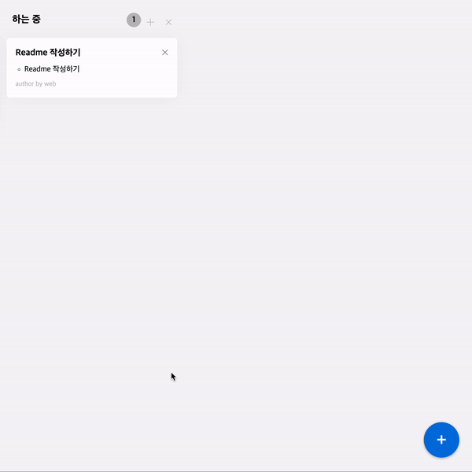
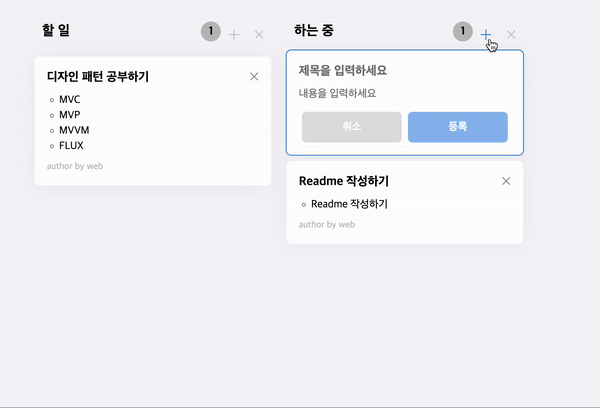
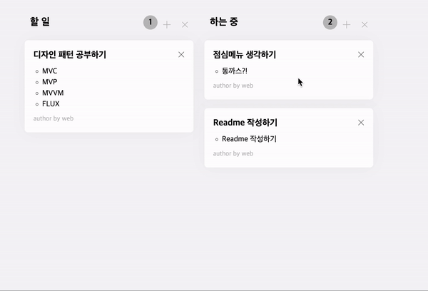
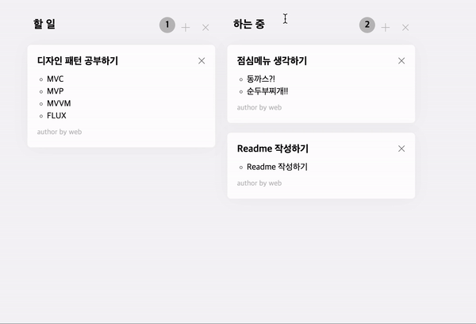
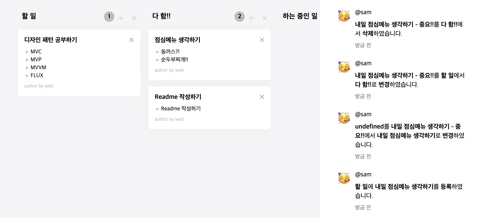
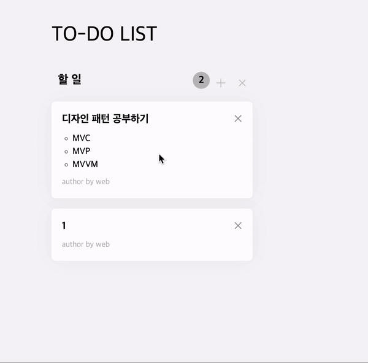
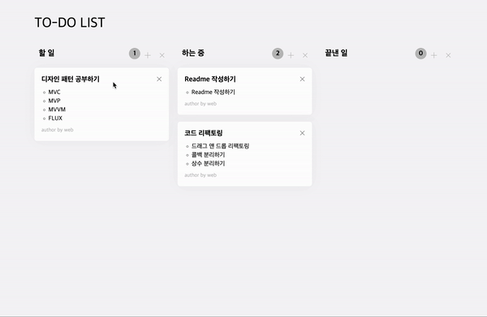
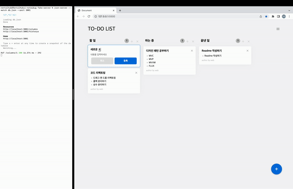

# fe-web-todo

# 🧰 기능

## Column 추가, 삭제



## Card 추가, 삭제



## Card 내용 수정



## Column 제목 수정



## History 남기기



---

# 🏋️ 도전사항 ⁉️ 🏋️

## 드래그와 더블클릭 같이 쓰기



드래그를 했을 때는 카드의 위치를 바꿀 수 있어야 하고, 더블클릭으로는 카드의 내용을 수정하도록 기능 구현을 해야 합니다. draggable api를 사용하지 않고 drag n drop 을 구현하기 위해서는 mouse down 이벤트로 드래그의 시작을 알려야 합니다. 그리고 드래그 이벤트를 시작하죠. 하지만 더블클릭을 하려고 해도 mousedown을 수행하게 되는데 이는 더블클릭이 안되는 현상을 유발합니다. 더블클릭을 하려고 mousedown을 하면 드래그 이벤트가 발동하기 때문이죠. 저는 이를 `시간차`를 이용해서 해결하였습니다.

mousedown 이벤트는 다음과 같이 구성합니다.

- mousedown 이 후 클릭이 되고 있는지 `isPress` 변수로 알 수 있게 합니다.
- 계속 붙잡고 있는지 판단하는 hold 함수를 일정 시간 뒤에 실행시키도록 만듭니다.
- 일정 시간 이후에도 누르고 있다면 drag 이벤트를 실행시키고 그렇지 않다면 더블클릭 이벤트를 실행시키도록 합니다.

```js
  //...
  DELAY = 400;
  timer = null;
  isPress = false;

  mouseDown(event) {
    this.isPress = true;
    this.timer = setTimeout(() => {
      this.hold(event);
    }, this.DELAY);
  }

  hold(event) {
    if (this.timer) clearTimeout(this.timer);
    if (this.isPress) this.drag(event);
  }
```

---

## 드래그 앤 드랍 구현하기



---

## json-server 연동하기

서버 돌리기 `json-server --watch db.json --port 3001`


---

## component 구현

---

## 🥊 **flux pattern 흉내내기** 🥊

Flux는 사용자 입력을 기반으로 Action을 만들고 Action을 Dispatcher에 전달하여 Store(Model)의 데이터를 변경한 뒤 View에 반영하는 단방향의 흐름으로 애플리케이션을 만드는 아키텍처입니다. 구조는 다음의 그림과 같습니다.


### **Action**

Action이란 사용자가 어떠한 이유로든 데이터를 변경하는 행위입니다. dispatch 메서드는 새로 발생한 Action의 종류(actionKey)와 새로운 데이터(payload)를 묶어 Dispatcher에게 전달합니다.  
다양한 액션이 있겠지만 예를 들어 `/src/App.js`의 코드를 보겠습니다.

```js
import { TodoListStore } from './store/TodoListStore.js';
//...
this.addEvent('click', '.fab', () => {
  TodoListStore.dispatch(ACTION.ADD_COLUMN);
});
```

`fab` 버튼을 누르면 TodoListStore 의 dispatcher로 유저 액션을 전달해줍니다.

<br>

### **Dispather**

Dispatcher는 모든 데이터의 흐름을 관리하는 중앙 허브입니다. Dispatcher에는 Store들이 등록해놓은 Action 타입에 따라 데이터를 가공하고 새로운 state를 반환합니다. Store의 데이터를 조작하는 것은 Dispatcher를 통해서만 가능합니다.  
`/src/store/TodoListStore.js`의 코드를 보겠습니다.

```js
const reducer = (state, actionKey, payload = {}) => {
  //...
  switch (actionKey) {
    case ACTION.ADD_COLUMN:
      return DataHandler.addColumn(newState);
    case ACTION.INIT_DATA:
      return getServerData();
    case ACTION.TOGGLE_NEW_CARD:
      return DataHandler.toggleNewCard(newState, columnIdx);
    case ACTION.DELETE_COLUMN:
      return DataHandler.deleteColumn(newState, columnIdx);
    // more cases...
  }
};

export const TodoListStore = new Store(initState, reducer);
```

actionKey 가 `ADD_COLUMN` 이었으니 `DataHandler.addColumn`가 호출되며 새로운 컬럼을 추가한 새로운 state가 반환되게 되고 (DataHandler의 내용) reducer 또한 그 새로운 state를 반환합니다.

<br>

### **Store**

위에서 봤던 코드의 마지막 줄 `new Store()`의 정체를 `/src/store/Store.js`에서 보겠습니다.

```js
class Store {
  #state;
  #listeners;
  #reducer;

  constructor(state, reducer) {
    this.#state = state;
    this.#reducer = reducer;
  }

  getState() {
    return { ...this.#state };
  }

  subscribe(func) {
    this.#listeners = func;
  }

  publish() {
    this.#listeners();
  }

  async dispatch(actionKey, { ...payload } = {}) {
    this.#state = await this.#reducer(this.#state, actionKey, { ...payload });
    this.publish();
  }
}
```

위에 있던 reducer가 실행이 되며 새로운 state를 반환하고 그 state를 TodolistStore의 state로 저장한 후 publish(View를 렌더하는 메소드) 하게 됩니다. 해당 state와 관련된 많은 listeners들에게 전부 알려주는 것 또한 가능합니다. `#listeners = new Set();` 또는 Map 배열 등 상황에 따라 다양한 listeners를 구성하는 것이 가능하지만 본 프로젝트에서는 App을 렌더하는 것으로 충분하기에 위와 같이 구현하였습니다.

```js
// src/App.js
class App extends Component {
  setup() {
    //...
    TodoListStore.subscribe(this.render.bind(this));
  }
  //...
}
```

App에서 렌더 메소드를 구독하면 listeners에 저장되고, reducer를 통해 들어온 명령으로 state를 바꾼후 publish를 통해 해당 렌더 함수를 호출하는 구조입니다.

---

## card details 늘리기
