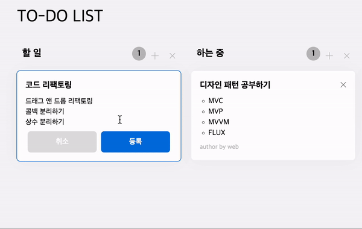

# fe-web-todo

# 기능

# 도전사항 ⁉️

## 드래그와 더블클릭 같이 쓰기


드래그를 했을 때는 카드의 위치를 바꿀 수 있어야 하고, 더블클릭으로는 카드의 내용을 수정하도록 기능 구현을 해야 합니다. draggable api를 사용하지 않고 drag n drop 을 구현하기 위해서는 mouse down 이벤트로 드래그의 시작을 알려야 합니다. 그리고 드래그 이벤트를 시작하죠. 하지만 더블클릭을 하려고 해도 mousedown을 수행하게 되는데 이는 더블클릭이 안되는 현상을 유발합니다. 더블클릭을 하려고 mousedown을 하면 드래그 이벤트가 발동하기 때문이죠. 저는 이를 `시간차`를 이용해서 해결하였습니다.

mousedown 이벤트는 다음과 같이 구성합니다.

- mousedown 이 후 클릭이 되고 있는지 `isPress` 변수로 알 수 있게 합니다.
- 계속 붙잡고 있는지 판단하는 hold 함수를 일정 시간 뒤에 실행시키도록 만듭니다.
- 일정 시간 이후에도 누르고 있다면 drag 이벤트를 실행시키고 그렇지 않다면 더블클릭 이벤트를 실행시키도록 합니다.

```js
  //...
  DELAY = 400;
  timer = null;
  isPress = false;

  mouseDown(event) {
    this.isPress = true;
    this.timer = setTimeout(() => {
      this.hold(event);
    }, this.DELAY);
  }

  hold(event) {
    if (this.timer) clearTimeout(this.timer);
    if (this.isPress) this.drag(event);
  }
```

---

## 드래그 앤 드랍 구현하기


---

## json-server 연동하기

서버 돌리기 `json-server --watch db.json --port 3001`


---

## component 구현

---

## flux pattern 흉내내기

---

## card details 늘리기


